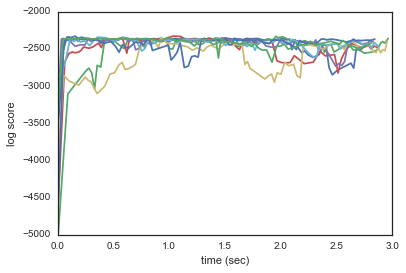
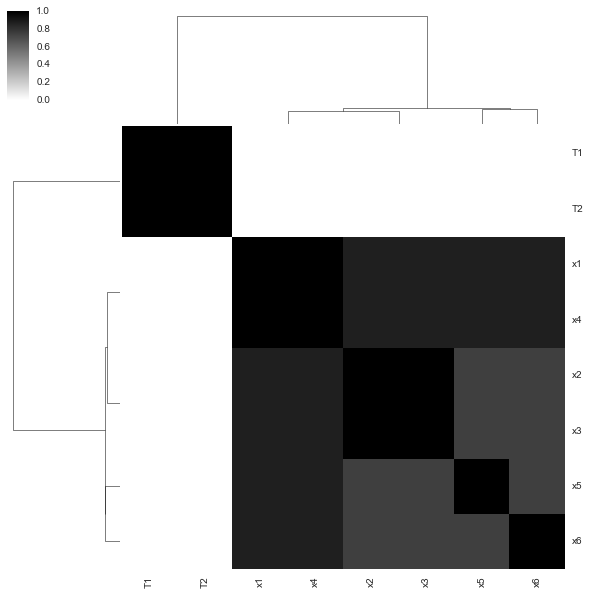

Getting started
===============

About baxcat
------------

baxcat is a scaleable and correct implementation of cross-categoization.
Cross-categoization [Crosscat2011]_ assigns a joint probability distribution to
a table of data by grouping columns into *views* and, within views, grouping
rows into *categories*. The user does not need to supply the number of view or
catgories, and data to need not obey any assunptions of linearity or the like.
baxcat allows you to find outliers, simulate and calulate the probabilites of
hypothetical events, impute missing data, identify and charachterize the
dependencies between variables, and more.

Installation
------------

Installation has only been tested on OSX and Ubuntu (Trusty) and
requires a C++11, OpenMP compiler (GCC). To run c++ tests, you'll also
need Boost and MGL.

Ubuntu Trusty

::

    $ sudo apt-get update
    $ sudo apt-get install libboost-all-dev liblapack-dev libblas-dev mathgl libmgl-dev python3-dev
    $ python setup.py develop
    $ git clone https://github.com/BaxterEaves/baxcat_cxx.git
    $ cd baxcat_cxx
    $ pip install .

OSX (requires homebrew, virtualenv, and virtualenvwrapper)

::

    $ brew install boost libgml gcc5 python3
    $ mkvirtualenv --python=`which python3` baxcat
    (baxcat)$ git clone https://github.com/BaxterEaves/baxcat_cxx.git
    (baxcat)$ cd baxcat
    (baxcat)$ pip install .

Tests
-----

Unit tests
~~~~~~~~~~

To run the python unit tests

::

    $ cd baxcat && py.test

To run the c++ unit tests

::

    $ cd cxx && make unit

Inference tests
~~~~~~~~~~~~~~~

We use joint disrtribution tests to test the correctness of the sampler.
For more on joint distribution tests see the [Geweke2004]_ or
`this blog post <http://baxtereaves.com/posts/mcmc>`__ for a tutorial.

Be aware that the joint distribution tests take awhile to run. To run
them yourself

::

    $ cd cxx && make geweke

In addition to test output, visual output is saved to the ``results`` folder.

Your first analysis
-------------------

For your first analysis, you'll generate some synthetic data with a
hidden dependence between two columns and make sure that baxcat finds it.
The first thing to do is generate two columns of data from a
multivariate normal with rho=.8 and six more columns from uncorrelated,
univariate standard normals

.. code:: python

    import numpy as np
    
    n = 200
    cov = np.array([[1., .8], [.8, 1.]])
    mean = np.array([0., 0.])
    data = np.hstack((np.random.multivariate_normal(mean, cov, n),
                      np.random.randn(n, 6),))

baxcat works on pandas ``DataFrame`` objects. Let's convert the numpy
array to a ``DataFrame``

.. code:: python

    import pandas as pd
    
    df = pd.DataFrame(data)
    df.columns = ['T1', 'T2', 'x1', 'x2', 'x3', 'x4', 'x5', 'x6']

Now we'll create a ``Engine`` object, load the data and check that
baxcat has inferred the correct data type for each column. baxcat
currently supports continuous and categorical variables.

.. code:: python

    from baxcat.engine import Engine
    
    engine = Engine(df, n_models=8)
    engine.col_info()

.. raw:: html

    

    <table border="1" class="dataframe">
      <thead>
        <tr style="text-align: right;">
          <th></th>
          <th>dtype</th>
          <th>cardinality</th>
        </tr>
      </thead>
      <tbody>
        <tr>
          <th>T1</th>
          <td>continuous</td>
          <td>NaN</td>
        </tr>
        <tr>
          <th>T2</th>
          <td>continuous</td>
          <td>NaN</td>
        </tr>
        <tr>
          <th>x1</th>
          <td>continuous</td>
          <td>NaN</td>
        </tr>
        <tr>
          <th>x2</th>
          <td>continuous</td>
          <td>NaN</td>
        </tr>
        <tr>
          <th>x3</th>
          <td>continuous</td>
          <td>NaN</td>
        </tr>
        <tr>
          <th>x4</th>
          <td>continuous</td>
          <td>NaN</td>
        </tr>
        <tr>
          <th>x5</th>
          <td>continuous</td>
          <td>NaN</td>
        </tr>
        <tr>
          <th>x6</th>
          <td>continuous</td>
          <td>NaN</td>
        </tr>
      </tbody>
    </table>
    

     

baxcat uses approximate inference method to collect samples from a
distribution of cross-categorization model. It averages its answer over
these models. The more baxcat uses, the more likely our answers are not
to be skewed by weird modes in the distribution, and the finer
resolution we get when asking about things like the probability of
dependence between columns.

Since we don't have much data, we initialized just a few models
(``n_models=8``). We then run the sampling algorithm on the models for a
predetermined number of steps.  We'll also tell baxcat to take diagnostic
information every five sampler iterations by specifying ``checkpoint=5``.

.. code:: python

    engine.init_models()
    engine.run(400, checkpoint=5)

Let's see if our sampler has converged. If it hasn't, we'll need to run
it more or our inferences will be wrong.

.. code:: python

    %matplotlib inline
    engine.convergence_plot(log_x_axis=False)

We want the log scores to settle down with time. Jump around is fine; we
just don't want to see strictly upward movement---that means that the
search algorithm is still in a low-probability area.

Now we can see if we've found the dependence between the ``T1`` and
``T2``. We can ask about pairs of columns directly using
``Engine.dependence_probabiltiy`` or we can visualize the dependence
probabilty between every pair of columns using ``Engine.heatmap``.

.. code:: python

    engine.dependence_probability('T1', 'T2')

.. parsed-literal::

    1.0

.. code:: python

    engine.heatmap('dependence_probability')

Looks like the columns have been grouped into two clusters: the
dependent columns and the noise columns. That's exactly what we wanted.

Citations
---------

.. [Geweke2004] Geweke, J. (2004). Getting it right: Joint distribution tests of posterior simulators. Journal of the American Statistical Association. Retrieved from http://amstat.tandfonline.com/doi/full/10.1198/016214504000001132
.. [Crosscat2011] Shafto, P., Kemp, C., Mansinghka, V., & Tenenbaum, J. B. (2011). A probabilistic model of cross-categorization. Cognition, 120(1), 1–25. doi:10.1016/j.cognition.2011.02.010
