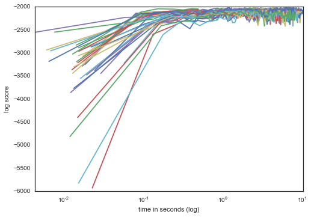
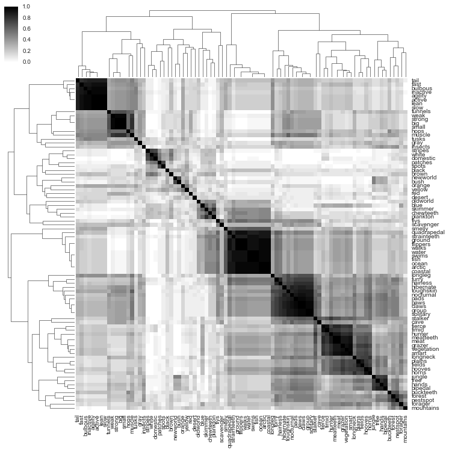
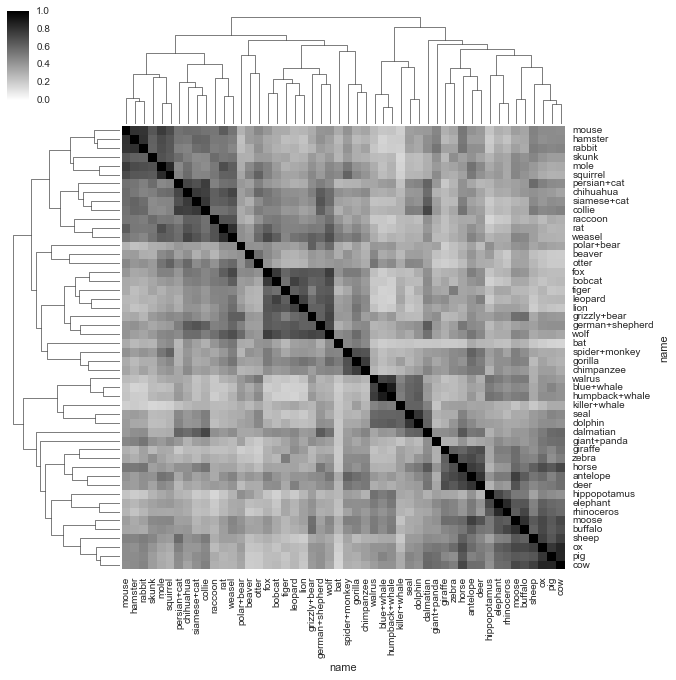

Tutorials
=========

Example 1. Animals and attributes
---------------------------------

In this example, we'll explore a dataset of animals taken from
`here <http://attributes.kyb.tuebingen.mpg.de/>`__. Each row of our
table is an animal and each column is a binary variable indicating
whether a given attribute is observed in that animal. You can find the
``animals.csv`` datafile in the ``examples`` directory.

First things first: let's create our ``Engine``. Well just pass in the
csv filename and let baxcat decide how to model each column.

.. code:: python

    from baxcat.engine import Engine
    
    engine = Engine('animals.csv')

We can see how baxcat decided to model each column by checking
``col_info``

.. code:: python

    engine.col_info()

.. raw:: html

    

    <table border="1" class="dataframe">
      <thead>
        <tr style="text-align: right;">
          <th></th>
          <th>dtype</th>
          <th>cardinality</th>
        </tr>
      </thead>
      <tbody>
        <tr>
          <th>black</th>
          <td>categorical</td>
          <td>2.0</td>
        </tr>
        <tr>
          <th>white</th>
          <td>categorical</td>
          <td>2.0</td>
        </tr>
        <tr>
          <th>blue</th>
          <td>categorical</td>
          <td>2.0</td>
        </tr>
        <tr>
          <th>brown</th>
          <td>categorical</td>
          <td>2.0</td>
        </tr>
        <tr>
          <th>gray</th>
          <td>categorical</td>
          <td>2.0</td>
        </tr>
        <tr>
          <th>orange</th>
          <td>categorical</td>
          <td>2.0</td>
        </tr>
        <tr>
          <th>red</th>
          <td>categorical</td>
          <td>2.0</td>
        </tr>
        <tr>
          <th>yellow</th>
          <td>categorical</td>
          <td>2.0</td>
        </tr>
        <tr>
          <th>patches</th>
          <td>categorical</td>
          <td>2.0</td>
        </tr>
        <tr>
          <th>spots</th>
          <td>categorical</td>
          <td>2.0</td>
        </tr>
        <tr>
          <th>stripes</th>
          <td>categorical</td>
          <td>2.0</td>
        </tr>
        <tr>
          <th>furry</th>
          <td>categorical</td>
          <td>2.0</td>
        </tr>
        <tr>
          <th>hairless</th>
          <td>categorical</td>
          <td>2.0</td>
        </tr>
        <tr>
          <th>toughskin</th>
          <td>categorical</td>
          <td>2.0</td>
        </tr>
        <tr>
          <th>big</th>
          <td>categorical</td>
          <td>2.0</td>
        </tr>
        <tr>
          <th>small</th>
          <td>categorical</td>
          <td>2.0</td>
        </tr>
        <tr>
          <th>bulbous</th>
          <td>categorical</td>
          <td>2.0</td>
        </tr>
        <tr>
          <th>lean</th>
          <td>categorical</td>
          <td>2.0</td>
        </tr>
        <tr>
          <th>flippers</th>
          <td>categorical</td>
          <td>2.0</td>
        </tr>
        <tr>
          <th>hands</th>
          <td>categorical</td>
          <td>2.0</td>
        </tr>
        <tr>
          <th>hooves</th>
          <td>categorical</td>
          <td>2.0</td>
        </tr>
        <tr>
          <th>pads</th>
          <td>categorical</td>
          <td>2.0</td>
        </tr>
        <tr>
          <th>paws</th>
          <td>categorical</td>
          <td>2.0</td>
        </tr>
        <tr>
          <th>longleg</th>
          <td>categorical</td>
          <td>2.0</td>
        </tr>
        <tr>
          <th>longneck</th>
          <td>categorical</td>
          <td>2.0</td>
        </tr>
        <tr>
          <th>tail</th>
          <td>categorical</td>
          <td>2.0</td>
        </tr>
        <tr>
          <th>chewteeth</th>
          <td>categorical</td>
          <td>2.0</td>
        </tr>
        <tr>
          <th>meatteeth</th>
          <td>categorical</td>
          <td>2.0</td>
        </tr>
        <tr>
          <th>buckteeth</th>
          <td>categorical</td>
          <td>2.0</td>
        </tr>
        <tr>
          <th>strainteeth</th>
          <td>categorical</td>
          <td>2.0</td>
        </tr>
        <tr>
          <th>...</th>
          <td>...</td>
          <td>...</td>
        </tr>
        <tr>
          <th>insects</th>
          <td>categorical</td>
          <td>2.0</td>
        </tr>
        <tr>
          <th>forager</th>
          <td>categorical</td>
          <td>2.0</td>
        </tr>
        <tr>
          <th>grazer</th>
          <td>categorical</td>
          <td>2.0</td>
        </tr>
        <tr>
          <th>hunter</th>
          <td>categorical</td>
          <td>2.0</td>
        </tr>
        <tr>
          <th>scavenger</th>
          <td>categorical</td>
          <td>2.0</td>
        </tr>
        <tr>
          <th>skimmer</th>
          <td>categorical</td>
          <td>2.0</td>
        </tr>
        <tr>
          <th>stalker</th>
          <td>categorical</td>
          <td>2.0</td>
        </tr>
        <tr>
          <th>newworld</th>
          <td>categorical</td>
          <td>2.0</td>
        </tr>
        <tr>
          <th>oldworld</th>
          <td>categorical</td>
          <td>2.0</td>
        </tr>
        <tr>
          <th>arctic</th>
          <td>categorical</td>
          <td>2.0</td>
        </tr>
        <tr>
          <th>coastal</th>
          <td>categorical</td>
          <td>2.0</td>
        </tr>
        <tr>
          <th>desert</th>
          <td>categorical</td>
          <td>2.0</td>
        </tr>
        <tr>
          <th>bush</th>
          <td>categorical</td>
          <td>2.0</td>
        </tr>
        <tr>
          <th>plains</th>
          <td>categorical</td>
          <td>2.0</td>
        </tr>
        <tr>
          <th>forest</th>
          <td>categorical</td>
          <td>2.0</td>
        </tr>
        <tr>
          <th>fields</th>
          <td>categorical</td>
          <td>2.0</td>
        </tr>
        <tr>
          <th>jungle</th>
          <td>categorical</td>
          <td>2.0</td>
        </tr>
        <tr>
          <th>mountains</th>
          <td>categorical</td>
          <td>2.0</td>
        </tr>
        <tr>
          <th>ocean</th>
          <td>categorical</td>
          <td>2.0</td>
        </tr>
        <tr>
          <th>ground</th>
          <td>categorical</td>
          <td>2.0</td>
        </tr>
        <tr>
          <th>water</th>
          <td>categorical</td>
          <td>2.0</td>
        </tr>
        <tr>
          <th>tree</th>
          <td>categorical</td>
          <td>2.0</td>
        </tr>
        <tr>
          <th>cave</th>
          <td>categorical</td>
          <td>2.0</td>
        </tr>
        <tr>
          <th>fierce</th>
          <td>categorical</td>
          <td>2.0</td>
        </tr>
        <tr>
          <th>timid</th>
          <td>categorical</td>
          <td>2.0</td>
        </tr>
        <tr>
          <th>smart</th>
          <td>categorical</td>
          <td>2.0</td>
        </tr>
        <tr>
          <th>group</th>
          <td>categorical</td>
          <td>2.0</td>
        </tr>
        <tr>
          <th>solitary</th>
          <td>categorical</td>
          <td>2.0</td>
        </tr>
        <tr>
          <th>nestspot</th>
          <td>categorical</td>
          <td>2.0</td>
        </tr>
        <tr>
          <th>domestic</th>
          <td>categorical</td>
          <td>2.0</td>
        </tr>
      </tbody>
    </table>
    
85 rows × 2 columns

    

``baxcat`` correctly inferes that all of the columns are binary
categorical variables.

To do inference, we intialize some cross-categorization states with
``init_models`` then ``run`` the inference. We intitialize many models
to hedge the inferences we make. Every model is a draw from the
posterior. We want to make inference about the data given the posterior
distribution of states, so we take several models.

Let's initialize 32 models and run them for 500 iterations, taking
diagnostic information every 5th iteration.

.. code:: python

    engine.init_models(32)
    engine.run(500, checkpoint=5)

Let's use that diagnostic information to check whether inference has
converged. We plot the log score for each model as a function of time
and make sure they all have leveled out.

.. code:: python

    engine.convergence_plot()

Looks good. Now let's see what ``baxcat`` has learned.

We can view which columns are dependent on which other columns by
plotting an ``n_cols`` by ``n_cols`` matrix where each cell is the
dependence probability between a pair of columns. Note that the
dependence probability is simply the probability that a dependence
exists, not the strength of the dependence.

.. code:: python

    engine.heatmap('dependence_probability', plot_kwargs={'figsize': (12, 12,)})

We see that there are large blocks of variables that are very likely
dependent. For example the variables relating to whether something is
aquatic are dependent and the variables that relating to whether
something is fast or slow are related.

We can see which animals are more or less similar by plotting row
similarity in the same way as we did dependent probability.

.. code:: python

    engine.heatmap('row_similarity', plot_kwargs={'figsize': (10, 10,)})

We see that hippos, rhinos, and elephants are similar to eachother and
that humpback whales, blue whales, and wlruses are similar.

Let's learn about the predictiveness of variables. For example, a
bad-ass paint job is an important part of what makes a pine wood derby
car fast, but does it matter for animals? We'll use the linfoot
information to determine how predictive variables are of whether an
animal is fast. Linfoot if basically the information-theoretic
counterpart to correlation.

.. code:: python

    engine.mutual_information('fast', 'lean', linfoot=False)

.. parsed-literal::

    0.13798922812320197

.. code:: python

    engine.mutual_information('fast', 'stripes', linfoot=False)

.. parsed-literal::

    0.0

So animal's leaness is more predictive of its fastness than whether it
has racing stripes.

We can also figure out which specific animals are more similar. Is a
wolf more similar to a wolf or a rat.

.. code:: python

    engine.row_similarity('chihuahua', 'wolf')

.. parsed-literal::

    0.57072172619047612

.. code:: python

    engine.row_similarity('chihuahua', 'rat')

.. parsed-literal::

    0.67254464285714288

That's artifical selection for you. Despite being the same species as
wolves, Chihuahuas are more rat-like than wolf-like.

Which animals are outliers with respect to their being fast. We can find
out by calculating the surprisal (self infotmation).

.. code:: python

    s = engine.surprisal('fast')
    s.sort_values(by=['surprisal'], ascending=False, inplace=True)
    s.head(10)

.. raw:: html

    

    <table border="1" class="dataframe">
      <thead>
        <tr style="text-align: right;">
          <th></th>
          <th>fast</th>
          <th>surprisal</th>
        </tr>
      </thead>
      <tbody>
        <tr>
          <th>buffalo</th>
          <td>1</td>
          <td>0.786738</td>
        </tr>
        <tr>
          <th>moose</th>
          <td>1</td>
          <td>0.738316</td>
        </tr>
        <tr>
          <th>giant+panda</th>
          <td>0</td>
          <td>0.690535</td>
        </tr>
        <tr>
          <th>cow</th>
          <td>0</td>
          <td>0.553802</td>
        </tr>
        <tr>
          <th>ox</th>
          <td>0</td>
          <td>0.553802</td>
        </tr>
        <tr>
          <th>pig</th>
          <td>0</td>
          <td>0.519231</td>
        </tr>
        <tr>
          <th>elephant</th>
          <td>0</td>
          <td>0.519231</td>
        </tr>
        <tr>
          <th>rhinoceros</th>
          <td>0</td>
          <td>0.519231</td>
        </tr>
        <tr>
          <th>hippopotamus</th>
          <td>0</td>
          <td>0.494934</td>
        </tr>
        <tr>
          <th>sheep</th>
          <td>0</td>
          <td>0.491374</td>
        </tr>
      </tbody>
    </table>
    

     

It is rather surprising that buffalo and moose are fast but cows and
oxen are slow.

Lets say we're out in the woods and we see a lean, spotted animal with a
tail. What is the probability that it is fierce and fast? Note that for
continuous variables, Engine.probability returns the log PDF of an event
given observations.

.. code:: python

    from math import exp
    logpmf = engine.probability([1, 1], ['fierce', 'fast'],
                                given=[('lean', 1,), ('spots', 1,), ('tail', 1,)])
    exp(logpmf)

.. parsed-literal::

    0.3546113814838271

``baxcat`` says "Climb a tree!"
